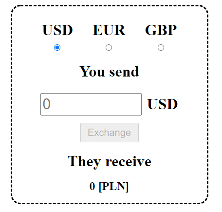
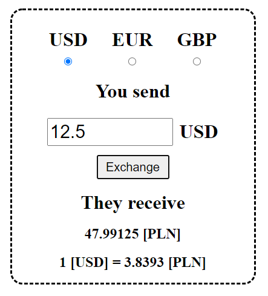
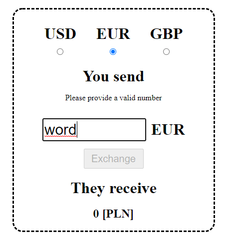

# Currency exchange

# Introduction
Application created as part of a recruitment process. Build using Spring-boot and Angular.
- [x] Implemented a rate calculator method or function
- [x] Readme includes how to run instructions
- [x] Used real rates
- [x] Unit Tests
- [x] User Interface
- [x] Implemented a web server

# Screenshots




# Build
Download repository and from the root directory run:
```
mvn package
```
Which will download necessary dependencies, run unit tests and create jar file. <br>
It will also download node packages and build a frontend of the application <br>
Note, that you need to have a Maven installed on your machine as well as Java JDK (Preferably Java 11).<br>
Next, run:
```
mvn spring-boot:run
```
Which will make a website available on the port 8080 of your localhost. <br>
Go to the `http://localhost:8080`.